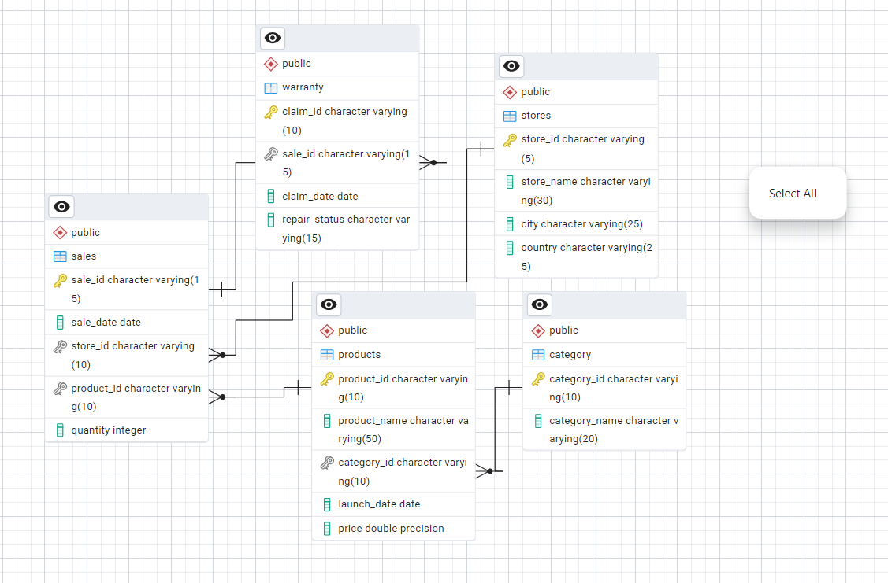

# Apple-Retail-1-Million-Sales-Row-SQL-Project

 Apple Retail Sales SQL Project - Analyzing Millions of Sales Row

## Project Overview

This project is designed to showcase advanced SQL querying techniques through the analysis of over 1 million rows of Apple retail sales data. The dataset includes information about products, stores, sales transactions, and warranty claims across various Apple retail locations globally. By tackling a variety of questions, from basic to complex, you'll demonstrate your ability to write sophisticated SQL queries that extract valuable insights from large datasets.

The project is ideal for data analysts looking to enhance their SQL skills by working with a large-scale dataset and solving real-world business questions.

## Entity Relationship Diagram (ERD)




Here’s the shortened and improved version of the "What’s Included" and "Why Choose This Project" sections, along with the link:

---

### What’s Included:
- **2s Advanced SQL Queries**: Step-by-step solutions for complex queries, enhancing your skills in performance tuning and optimization.
- **5 Detailed Tables**: Comprehensive datasets with over 1 million rows, including sales, stores, product categories, products, and warranties.
- **Query Performance Tuning**: Learn to optimize queries for real-world data handling.
- **Portfolio-Ready Project**: Showcase your SQL expertise through large-scale data analysis.

# Advanced SQL Queries Documentation


## Database Schema

The project uses five main tables:

1. **stores**: Contains information about Apple retail stores.
   - `store_id`: Unique identifier for each store.
   - `store_name`: Name of the store.
   - `city`: City where the store is located.
   - `country`: Country of the store.

2. **category**: Holds product category information.
   - `category_id`: Unique identifier for each product category.
   - `category_name`: Name of the category.

3. **products**: Details about Apple products.
   - `product_id`: Unique identifier for each product.
   - `product_name`: Name of the product.
   - `category_id`: References the category table.
   - `launch_date`: Date when the product was launched.
   - `price`: Price of the product.

4. **sales**: Stores sales transactions.
   - `sale_id`: Unique identifier for each sale.
   - `sale_date`: Date of the sale.
   - `store_id`: References the store table.
   - `product_id`: References the product table.
   - `quantity`: Number of units sold.

5. **warranty**: Contains information about warranty claims.
   - `claim_id`: Unique identifier for each warranty claim.
   - `claim_date`: Date the claim was made.
   - `sale_id`: References the sales table.
   - `repair_status`: Status of the warranty claim (e.g., Paid Repaired, Warranty Void).

## Objectives

The project is split into three tiers of questions to test SQL skills of increasing complexity:

### Easy to Medium (10 Questions)

1. Find the number of stores in each country.
2. Calculate the total number of units sold by each store.
3. Identify how many sales occurred in December 2023.
4. Determine how many stores have never had a warranty claim filed.
5. Calculate the percentage of warranty claims marked as "Warranty Void".
6. Identify which store had the highest total units sold in the last year.
7. Count the number of unique products sold in the last year.
8. Find the average price of products in each category.
9. How many warranty claims were filed in 2020?
10. For each store, identify the best-selling day based on highest quantity sold.

### Medium to Hard (5 Questions)

11. Identify the least selling product in each country for each year based on total units sold.
12. Calculate how many warranty claims were filed within 180 days of a product sale.
13. Determine how many warranty claims were filed for products launched in the last two years.
14. List the months in the last three years where sales exceeded 5,000 units in the USA.
15. Identify the product category with the most warranty claims filed in the last two years.

### Complex (5 Questions)

16. Determine the percentage chance of receiving warranty claims after each purchase for each country.
17. Analyze the year-by-year growth ratio for each store.
18. Calculate the correlation between product price and warranty claims for products sold in the last five years, segmented by price range.
19. Identify the store with the highest percentage of "Paid Repaired" claims relative to total claims filed.
20. Write a query to calculate the monthly running total of sales for each store over the past four years and compare trends during this period.
 Analyze product sales trends over time, segmented into key periods: from launch to 6 months, 6-12 months, 12-18 months, and beyond 18 months.

# Advanced SQL Queries Documentation


## Database Schema Setup

### **Create Tables**
```sql
CREATE TABLE stores(
    store_id VARCHAR(5) PRIMARY KEY,
    store_name VARCHAR(30),
    city VARCHAR(25),
    country VARCHAR(25)
);

CREATE TABLE category(
    category_id VARCHAR(10) PRIMARY KEY,
    category_name VARCHAR(20)
);

CREATE TABLE products(
    product_id VARCHAR(10) PRIMARY KEY,
    product_name VARCHAR(50),
    category_id VARCHAR(10),
    launch_date DATE,
    price FLOAT,
    CONSTRAINT fk_category FOREIGN KEY (category_id) REFERENCES category(category_id)
);

CREATE TABLE sales(
    sale_id VARCHAR(15) PRIMARY KEY,
    sale_date DATE,
    store_id VARCHAR(10),
    product_id VARCHAR(10),
    quantity INT,
    CONSTRAINT fk_store FOREIGN KEY (store_id) REFERENCES stores(store_id),
    CONSTRAINT fk_product FOREIGN KEY (product_id) REFERENCES products(product_id)
);

CREATE TABLE warranty(
    claim_id VARCHAR(10) PRIMARY KEY,
    sale_id VARCHAR(15),
    claim_date DATE,
    repair_status VARCHAR(15),
    CONSTRAINT fk_orders FOREIGN KEY (sale_id) REFERENCES sales(sale_id)
);
```

## Medium Level SQL Queries

### **Q1: Find the number of stores in each country.**
```sql
SELECT country, COUNT(store_name) AS no_store
FROM stores
GROUP BY country
ORDER BY no_store DESC;
```

### **Q2: Calculate the total number of units sold by each store.**
```sql
SELECT st.store_name, s.store_id, SUM(s.quantity) AS total_no_units_sold
FROM stores AS st
JOIN sales AS s ON st.store_id = s.store_id
GROUP BY st.store_name, s.store_id
ORDER BY total_no_units_sold DESC;
```

### **Q3: Identify how many sales occurred in December 2023.**
```sql
SELECT COUNT(sale_id) AS total_sale
FROM sales
WHERE TO_CHAR(sale_date, 'MM-YYYY') = '12-2023';
```

### **Q4: Determine how many stores have never had a warranty claim filed.**
```sql
SELECT COUNT(*) AS total_stores
FROM stores
WHERE store_id NOT IN (
    SELECT DISTINCT store_id FROM sales AS s
    RIGHT JOIN warranty AS w ON s.sale_id = w.sale_id
);
```

### **Q5: Calculate the percentage of warranty claims marked as "REPLACED".**
```sql
SELECT ROUND(COUNT(claim_id) / (SELECT COUNT(*) FROM warranty) :: NUMERIC * 100, 2) AS Avg_Of_Replaced_claim
FROM warranty
WHERE repair_status = 'Replaced';
```

### **Q6: Identify which store had the highest total units sold in the last year.**
```sql
SELECT st.store_id, st.store_name, SUM(quantity) AS total_quantity_sold
FROM sales AS s
JOIN stores AS st ON s.store_id = st.store_id
WHERE sale_date >= (CURRENT_DATE - INTERVAL '1 YEAR')
GROUP BY st.store_id, st.store_name
ORDER BY total_quantity_sold DESC LIMIT 1;
```

### **Q7: Count the number of unique products sold in the last year.**
```sql
SELECT COUNT(DISTINCT product_id) AS unique_products
FROM sales
WHERE sale_date >= (CURRENT_DATE - INTERVAL '1 YEAR');
```

### **Q8: Find the average price of products in each category.**
```sql
SELECT c.category_name, AVG(p.price) AS avg_price
FROM products AS p
JOIN category AS c ON c.category_id = p.category_id
GROUP BY c.category_name;
```

### **Q9: How many warranty claims were filed in 2020?**
```sql
SELECT COUNT(claim_id)
FROM warranty
WHERE TO_CHAR(claim_date, 'YYYY') = '2020';
```

### **Q10: For each store, identify the best-selling day based on the highest quantity sold.**
```sql
WITH RankedSales AS (
    SELECT store_id, sale_date AS best_selling_day,
           SUM(quantity) AS highest_quantity_sold,
           ROW_NUMBER() OVER (PARTITION BY store_id ORDER BY SUM(quantity) DESC) AS row_num
    FROM sales
    GROUP BY store_id, sale_date
)
SELECT store_id, best_selling_day, highest_quantity_sold
FROM RankedSales
WHERE row_num = 1
ORDER BY store_id;
```

---


# Advanced SQL Queries Documentation


## Medium to Advanced SQL Queries

### **Q11: Identify the least selling product in each country for each year based on total units sold.**
```sql
WITH product_rank AS (
    SELECT st.country, s.product_id, p.product_name, SUM(s.quantity) AS total_units_sold,
           RANK() OVER(PARTITION BY st.country ORDER BY SUM(s.quantity)) AS RANK
    FROM stores AS st
    JOIN sales AS s ON st.store_id = s.store_id
    JOIN products AS p ON p.product_id = s.product_id
    GROUP BY st.country, s.product_id, p.product_name
)
SELECT * FROM product_rank WHERE RANK = 1;
```

### **Q12: Calculate how many warranty claims were filed within 180 days of a product sale.**
```sql
SELECT COUNT(w.claim_id)
FROM sales AS s
LEFT JOIN warranty AS w ON s.sale_id = w.sale_id
WHERE sale_date - claim_date <= 180;
```

### **Q13: Determine how many warranty claims were filed for products launched in the last two years.**
```sql
SELECT p.product_name, COUNT(w.claim_id) AS NO_claims, COUNT(s.sale_id) AS NO_SOLD
FROM warranty AS w
RIGHT JOIN sales AS s ON s.sale_id = w.sale_id
JOIN products AS p ON p.product_id = s.product_id
WHERE p.launch_date >= CURRENT_DATE - INTERVAL '2 years'
GROUP BY p.product_name
HAVING COUNT(w.claim_id) > 0;
```

### **Q14: List the months in the last three years where sales exceeded 500 units in the USA.**
```sql
SELECT TO_CHAR(s.sale_date, 'MM-YYYY') AS month, SUM(s.quantity)
FROM sales AS s
JOIN stores AS st ON st.store_id = s.store_id
WHERE st.country = 'USA' AND s.sale_date >= CURRENT_DATE - INTERVAL '3 years'
GROUP BY sale_date
HAVING SUM(s.quantity) > 500;
```

### **Q15: Identify the product category with the most warranty claims filed in the last two years.**
```sql
SELECT c.category_name, COUNT(w.claim_id) AS total_claims
FROM warranty AS w
LEFT JOIN sales AS s ON s.sale_id = w.sale_id
JOIN products AS p ON p.product_id = s.product_id
JOIN category AS c ON c.category_id = p.category_id
WHERE w.claim_date >= CURRENT_DATE - INTERVAL '2 year'
GROUP BY c.category_name;
```

### **Q16: Determine the percentage chance of receiving warranty claims after each purchase for each country.**
```sql
SELECT country, toatal_sale, total_claim,
       COALESCE(toatal_sale :: NUMERIC / total_claim :: NUMERIC  * 100, 0) AS risk
FROM (
    SELECT st.country, SUM(quantity) AS toatal_sale, COUNT(w.claim_id) AS total_claim
    FROM warranty AS w
    LEFT JOIN sales AS s ON w.sale_id = s.sale_id
    JOIN stores AS st ON st.store_id = s.store_id
    GROUP BY st.country
) t2
ORDER BY risk DESC;
```

### **Q17: Analyze the year-by-year growth ratio for each store.**
```sql
WITH yearly_sales AS (
    SELECT s.store_id, st.store_name, EXTRACT(YEAR FROM sale_date) AS year,
           SUM(s.quantity * p.price) AS total_sale
    FROM sales AS s
    JOIN products AS p ON s.product_id = p.product_id
    JOIN stores AS st ON st.store_id = s.store_id
    GROUP BY s.store_id, EXTRACT(YEAR FROM sale_date), st.store_name
),
growth_ratio AS (
    SELECT store_name, year,
           LAG(total_sale, 1) OVER(PARTITION BY store_name ORDER BY year) AS last_year,
           total_sale AS current_year
    FROM yearly_sales
)
SELECT store_name, year, last_year, current_year,
       ROUND((current_year - last_year) :: NUMERIC / last_year :: NUMERIC * 100 ,2) AS GROWTH_RATIO
FROM growth_ratio
WHERE last_year IS NOT NULL AND year <> EXTRACT(YEAR FROM CURRENT_DATE);
```

### **Q18: Calculate the correlation between product price and warranty claims for products sold in the last five years.**
```sql
SELECT 
    CASE 
        WHEN p.price < 500 THEN 'Less Expensive Product'
        WHEN p.price BETWEEN 500 AND 1600 THEN 'Mid Range Product'
        ELSE 'Expensive Product'
    END AS price_range,
    COUNT(w.claim_id) AS total_claim
FROM warranty AS w
LEFT JOIN sales AS s ON s.sale_id = w.sale_id
LEFT JOIN products AS p ON s.product_id = p.product_id 
WHERE w.claim_date >= CURRENT_DATE - INTERVAL '5 years' 
GROUP BY price_range;
```

### **Q19: Identify the store with the highest percentage of "Repaired" claims relative to total claims filed.**
```sql
WITH total_repaired AS (
    SELECT st.store_name, s.store_id, COUNT(w.claim_id) AS total_repaired
    FROM warranty AS w
    LEFT JOIN sales AS s ON s.sale_id = w.sale_id
    JOIN stores AS st ON s.store_id = st.store_id
    WHERE repair_status = 'Repaired'
    GROUP BY st.store_name, s.store_id
),
claims_repair AS (
    SELECT st.store_name, s.store_id, COUNT(w.claim_id) AS total_claims_for_repaired
    FROM warranty AS w
    LEFT JOIN sales AS s ON s.sale_id = w.sale_id
    JOIN stores AS st ON s.store_id = st.store_id
    GROUP BY st.store_name, s.store_id
)
SELECT tr.store_name, tr.store_id, tr.total_repaired, cr.total_claims_for_repaired,
       ROUND(tr.total_repaired :: NUMERIC / cr.total_claims_for_repaired :: NUMERIC * 100,2) AS ratio_repaired
FROM total_repaired AS tr
JOIN claims_repair AS cr ON tr.store_id = cr.store_id;
```

---

# Advanced SQL Queries Documentation


## Database Schema Setup

### **Create Tables**
```sql
CREATE TABLE stores(
    store_id VARCHAR(5) PRIMARY KEY,
    store_name VARCHAR(30),
    city VARCHAR(25),
    country VARCHAR(25)
);

CREATE TABLE category(
    category_id VARCHAR(10) PRIMARY KEY,
    category_name VARCHAR(20)
);

CREATE TABLE products(
    product_id VARCHAR(10) PRIMARY KEY,
    product_name VARCHAR(50),
    category_id VARCHAR(10),
    launch_date DATE,
    price FLOAT,
    CONSTRAINT fk_category FOREIGN KEY (category_id) REFERENCES category(category_id)
);

CREATE TABLE sales(
    sale_id VARCHAR(15) PRIMARY KEY,
    sale_date DATE,
    store_id VARCHAR(10),
    product_id VARCHAR(10),
    quantity INT,
    CONSTRAINT fk_store FOREIGN KEY (store_id) REFERENCES stores(store_id),
    CONSTRAINT fk_product FOREIGN KEY (product_id) REFERENCES products(product_id)
);

CREATE TABLE warranty(
    claim_id VARCHAR(10) PRIMARY KEY,
    sale_id VARCHAR(15),
    claim_date DATE,
    repair_status VARCHAR(15),
    CONSTRAINT fk_orders FOREIGN KEY (sale_id) REFERENCES sales(sale_id)
);
```

## Medium Level SQL Queries

### **Q1 - Q10: Medium Level Queries**

[See Questions 1 to 10 Above]

## Advanced Level SQL Queries

### **Q20: Calculate the monthly running total of sales for each store over the past four years.**
```sql
WITH monthly_sales AS (
    SELECT store_id, EXTRACT(YEAR FROM sale_date) AS year, EXTRACT(MONTH FROM sale_date) AS month,
           SUM(p.price * s.quantity) AS total_revenue
    FROM sales AS s
    JOIN products AS p ON p.product_id = s.product_id
    GROUP BY store_id, EXTRACT(YEAR FROM sale_date), month
)
SELECT store_id, year, month, total_revenue,
       SUM(total_revenue) OVER(PARTITION BY store_id ORDER BY year, month) AS running_total
FROM monthly_sales;
```

### **Q21: Analyze product sales trends segmented into key periods from launch.**
```sql
SELECT p.launch_date, p.product_name, s.sale_date, s.quantity,
       CASE
           WHEN s.sale_date < p.launch_date THEN 'Pre-order'
           WHEN s.sale_date BETWEEN p.launch_date AND p.launch_date + INTERVAL '6 months' THEN '0-6 months'
           WHEN s.sale_date BETWEEN p.launch_date + INTERVAL '6 months' AND p.launch_date + INTERVAL '12 months' THEN '6-12 months'
           WHEN s.sale_date BETWEEN p.launch_date + INTERVAL '12 months' AND p.launch_date + INTERVAL '18 months' THEN '12-18 months'
           ELSE '18+ months'
       END AS sales_trend
FROM sales AS s
JOIN products AS p ON s.product_id = p.product_id;
```

### **Q22: Identify the top 3 best-selling products for each country in the last two years.**
```sql
WITH product_sales AS (
    SELECT st.country, p.product_id, p.product_name, SUM(s.quantity) AS total_units_sold,
           RANK() OVER(PARTITION BY st.country ORDER BY SUM(s.quantity) DESC) AS rank
    FROM sales AS s
    JOIN stores AS st ON st.store_id = s.store_id
    JOIN products AS p ON p.product_id = s.product_id
    WHERE s.sale_date >= CURRENT_DATE - INTERVAL '2 years'
    GROUP BY st.country, p.product_id, p.product_name
)
SELECT * FROM product_sales WHERE rank <= 3;
```

### **Q23: Find stores where sales have dropped for 3 consecutive months.**
```sql
WITH sales_trend AS (
    SELECT s.store_id, st.store_name, TO_CHAR(s.sale_date, 'YYYY-MM') AS sale_month,
           SUM(s.quantity) AS total_units_sold,
           LAG(SUM(s.quantity), 1) OVER(PARTITION BY s.store_id ORDER BY TO_CHAR(s.sale_date, 'YYYY-MM')) AS last_month,
           LAG(SUM(s.quantity), 2) OVER(PARTITION BY s.store_id ORDER BY TO_CHAR(s.sale_date, 'YYYY-MM')) AS two_months_ago
    FROM sales AS s
    JOIN stores AS st ON st.store_id = s.store_id
    GROUP BY s.store_id, st.store_name, TO_CHAR(s.sale_date, 'YYYY-MM')
)
SELECT store_id, store_name, sale_month, total_units_sold
FROM sales_trend
WHERE total_units_sold < last_month AND last_month < two_months_ago;
```

### **Q24: Calculate the average time between a product sale and a warranty claim.**
```sql
SELECT p.product_name, ROUND(AVG(w.claim_date - s.sale_date), 2) AS avg_days_to_claim
FROM warranty AS w
JOIN sales AS s ON s.sale_id = w.sale_id
JOIN products AS p ON s.product_id = p.product_id
WHERE w.claim_date IS NOT NULL
GROUP BY p.product_name
ORDER BY avg_days_to_claim DESC;
```

### **Q25: Identify stores with unusually low warranty claims compared to total sales.**
```sql
WITH store_sales AS (
    SELECT s.store_id, COUNT(s.sale_id) AS total_sales
    FROM sales AS s
    GROUP BY s.store_id
),
store_claims AS (
    SELECT s.store_id, COUNT(w.claim_id) AS total_claims
    FROM warranty AS w
    JOIN sales AS s ON w.sale_id = s.sale_id
    GROUP BY s.store_id
)
SELECT ss.store_id, ss.total_sales, COALESCE(sc.total_claims, 0) AS total_claims,
       ROUND((COALESCE(sc.total_claims, 0) * 100.0 / NULLIF(ss.total_sales, 0)), 2) AS claim_rate
FROM store_sales ss
LEFT JOIN store_claims sc ON ss.store_id = sc.store_id
ORDER BY claim_rate ASC;
```

---

📌 **This document provides optimized SQL queries for database setup, medium, and advanced-level analysis.**

🔗 **For more details, visit our repository!**


## Project Focus

This project primarily focuses on developing and showcasing the following SQL skills:

- **Complex Joins and Aggregations**: Demonstrating the ability to perform complex SQL joins and aggregate data meaningfully.
- **Window Functions**: Using advanced window functions for running totals, growth analysis, and time-based queries.
- **Data Segmentation**: Analyzing data across different time frames to gain insights into product performance.
- **Correlation Analysis**: Applying SQL functions to determine relationships between variables, such as product price and warranty claims.
- **Real-World Problem Solving**: Answering business-related questions that reflect real-world scenarios faced by data analysts.


## Dataset

- **Size**: 1 million+ rows of sales data.
- **Period Covered**: The data spans multiple years, allowing for long-term trend analysis.
- **Geographical Coverage**: Sales data from Apple stores across various countries.

## Conclusion

By completing this project, you will develop advanced SQL querying skills, improve your ability to handle large datasets, and gain practical experience in solving complex data analysis problems that are crucial for business decision-making. This project is an excellent addition to your portfolio and will demonstrate your expertise in SQL to potential employers.

---
